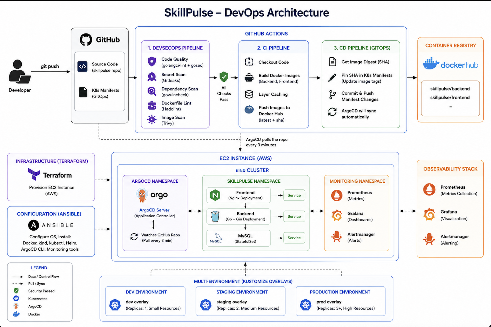
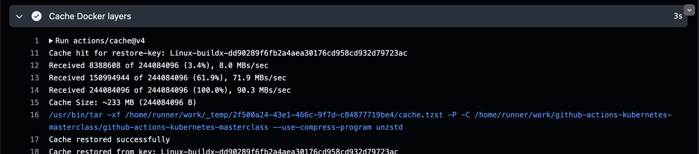
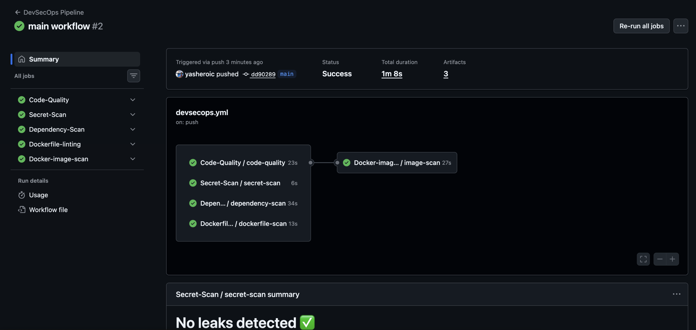
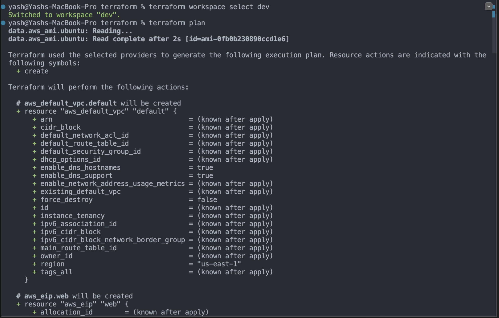
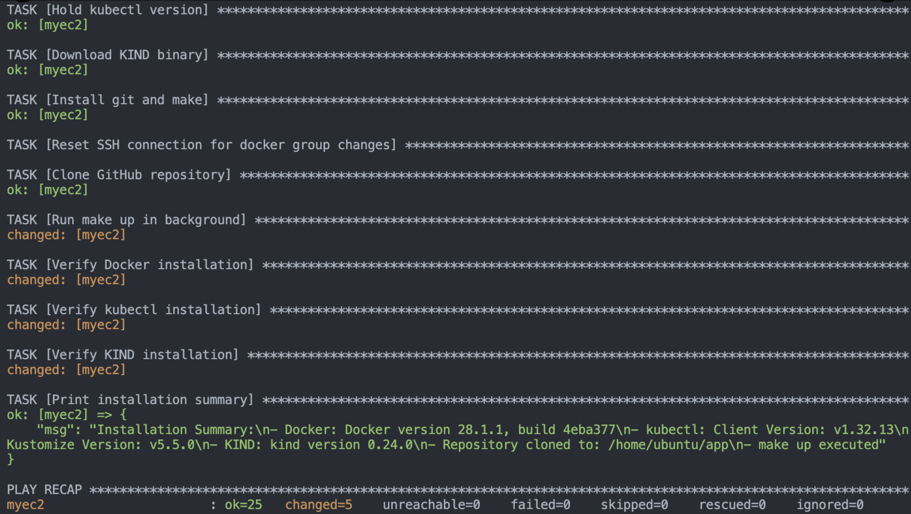
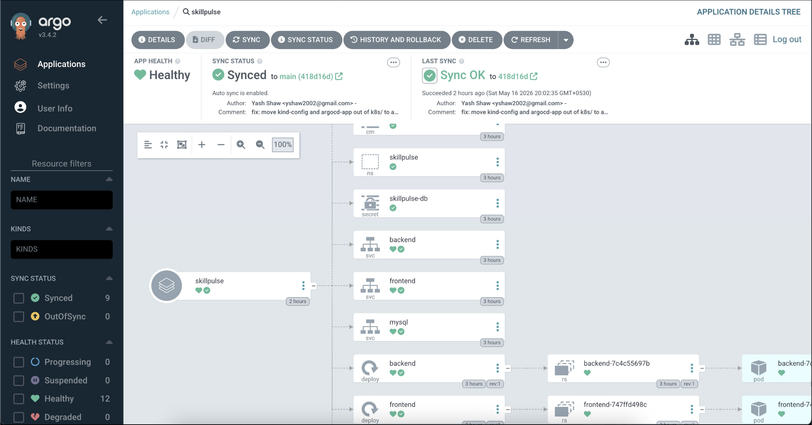
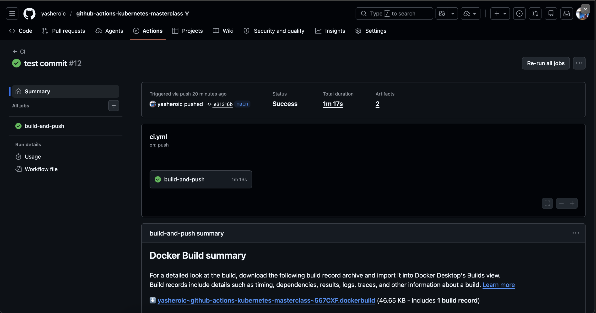
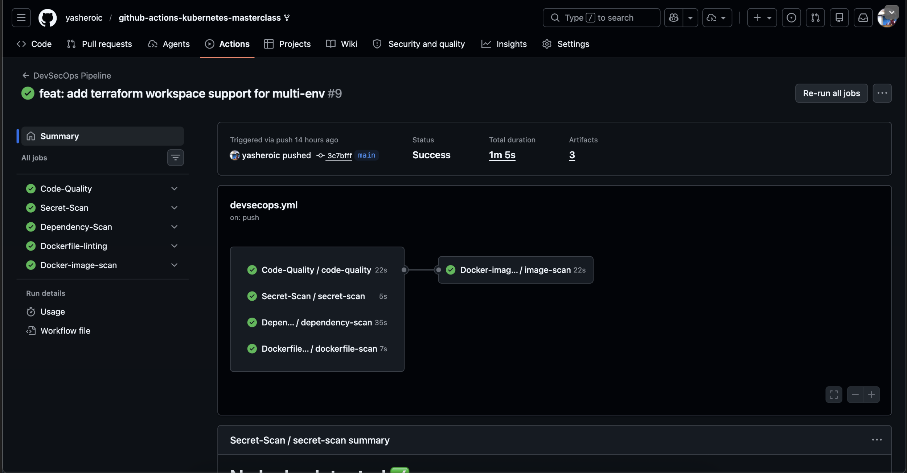
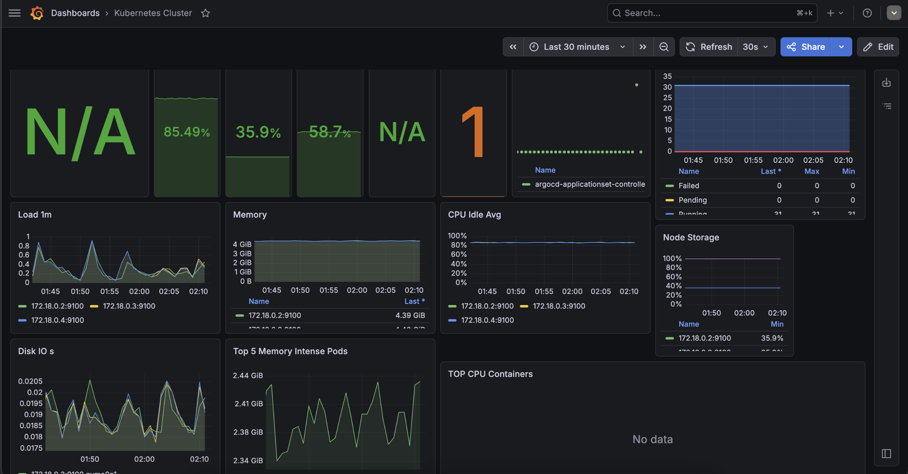
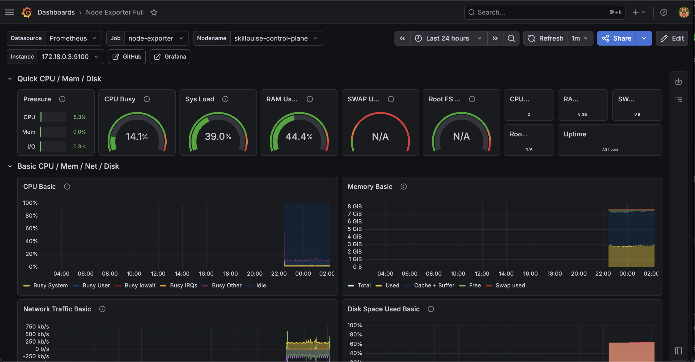

# SkillPulse — Production-Grade DevOps on Kubernetes

> A fully automated, secure, and observable 3-tier application deployment demonstrating modern DevOps practices end-to-end.



---

## 📌 Table of Contents

- [Overview](#overview)
- [Architecture](#architecture)
- [Tech Stack](#tech-stack)
- [Project Structure](#project-structure)
- [CI/CD Pipeline](#cicd-pipeline)
- [DevSecOps Pipeline](#devsecops-pipeline)
- [Infrastructure — Terraform](#infrastructure--terraform)
- [Configuration — Ansible](#configuration--ansible)
- [Kubernetes on kind](#kubernetes-on-kind)
- [GitOps — ArgoCD](#gitops--argocd)
- [Observability — Prometheus & Grafana](#observability--prometheus--grafana)
- [Multi-Environment — Kustomize](#multi-environment--kustomize)
- [Backup](#backup)
- [How to Run](#how-to-run)
- [Screenshots](#screenshots)

---

## Overview

SkillPulse is a skill-tracking application that lets you log skills and study hours. The application itself is intentionally simple — a Go backend, Nginx-served frontend, and MySQL database. **The real focus is everything around it**: a production-grade DevOps pipeline that takes a `git push` all the way to a running update on a Kubernetes cluster — with security scanning, observability, GitOps, and zero human intervention.

### What happens on every `git push`:

```
git push
    ↓
DevSecOps Pipeline runs in parallel:
  ├── Code Quality (golangci-lint + gosec SAST)
  ├── Secret Scan (Gitleaks)
  ├── Dependency Scan (govulncheck)
  ├── Dockerfile Lint (Hadolint)
  └── Docker Image Scan (Trivy)
    ↓
CI Pipeline:
  ├── Build Docker images (with layer caching)
  ├── Push to Docker Hub (tagged :latest + :sha)
    ↓
CD Pipeline:
  └── Pin image SHA in k8s manifests → commit back to repo
    ↓
ArgoCD (running in cluster):
  └── Detects manifest change → auto-applies → rolling update
    ↓
App is live with zero downtime ✅
```

---

## Architecture

```
Developer
    │
    │ git push
    ▼
┌─────────────────────────────────────────────────────────┐
│                      GitHub                             │
│                                                         │
│  ┌─────────────┐    ┌──────────────┐    ┌────────────┐  │
│  │  DevSecOps  │    │     CI       │    │     CD     │  │
│  │  Pipeline   │    │  Pipeline    │    │  Pipeline  │  │
│  │             │    │              │    │            │  │
│  │ • Gitleaks  │    │ • Build imgs │    │ • Pin SHA  │  │
│  │ • gosec     │───▶│ • Push Hub  │───▶│   in k8s   │  │
│  │ • Trivy     │    │ • Cache      │    │   manifest │  │
│  │ • Hadolint  │    │   layers     │    │ • Commit   │  │
│  │ • govulnchk │    │              │    │   to repo  │  │
│  └─────────────┘    └──────────────┘    └────────────┘  │
└─────────────────────────────────────────────────────────┘
                                               │
                                    ArgoCD polls repo
                                    every 3 minutes
                                               │
                                               ▼
┌─────────────────────────────────────────────────────────┐
│              EC2 (Terraform + Ansible)                  │
│                                                         │
│  ┌──────────────────────────────────────────────────┐   │
│  │              kind Cluster                        │   │
│  │                                                  │   │
│  │  ┌─────────────┐  ┌────────────────────────┐    │   │
│  │  │   argocd    │  │     skillpulse ns       │   │   │
│  │  │  namespace  │  │                        │    │   │
│  │  │             │  │  frontend (Nginx)       │    │   │
│  │  │  ArgoCD     │  │  backend  (Go + Gin)    │    │   │
│  │  │  watches    │  │  mysql    (StatefulSet) │    │   │
│  │  │  GitHub     │  │                        │    │   │
│  │  └─────────────┘  └────────────────────────┘    │   │
│  │                                                  │   │
│  │  ┌─────────────────────────────────────────┐     │   │
│  │  │           monitoring namespace           │     │   │
│  │  │  Prometheus + Grafana + Alertmanager     │     │   │
│  │  └─────────────────────────────────────────┘     │   │
│  └──────────────────────────────────────────────────┘   │
└─────────────────────────────────────────────────────────┘
```

---

## Tech Stack

| Layer | Tool | Purpose |
|---|---|---|
| **Application** | Go 1.26 + Gin | REST API backend |
| **Application** | HTML + CSS + Vanilla JS | Frontend UI |
| **Application** | MySQL 8.4 | Database |
| **Containerization** | Docker | Multi-stage image builds |
| **Registry** | Docker Hub | Image storage |
| **Infrastructure** | Terraform | EC2 provisioning |
| **Configuration** | Ansible | Server setup automation |
| **Orchestration** | Kubernetes (kind) | Container orchestration on EC2 |
| **CI/CD** | GitHub Actions | Automated pipeline |
| **GitOps** | ArgoCD | Pull-based continuous deployment |
| **Security** | Gitleaks | Secret scanning |
| **Security** | gosec | Go SAST |
| **Security** | golangci-lint | Go code quality |
| **Security** | govulncheck | Go dependency scanning |
| **Security** | Hadolint | Dockerfile linting |
| **Security** | Trivy | Container image scanning |
| **Observability** | Prometheus | Metrics collection |
| **Observability** | Grafana | Metrics visualization |
| **Observability** | Alertmanager | Alerting |
| **Multi-env** | Kustomize | Environment overlays |

---

## Project Structure

```
.
├── .github/
│   └── workflows/
│       ├── ci.yml                    # Build + push Docker images
│       ├── cd.yml                    # Legacy SSH deploy (disabled)
│       ├── cd-k8s.yml                # GitOps manifest bump
│       ├── devsecops.yml             # DevSecOps orchestrator
│       ├── code_quality.yml          # golangci-lint + gosec
│       ├── secret_scanning.yml       # Gitleaks
│       ├── dependency_scanning.yml   # govulncheck
│       ├── dockerfile_scanning.yml   # Hadolint
│       └── docker_image_scan.yml     # Trivy
├── ansible/
│   ├── ansible.cfg
│   ├── inventory.ini
│   └── playbook.yml                  # Install Docker, kind, kubectl
├── argocd/
│   ├── argocd-app.yaml               # ArgoCD Application manifest
│   └── kind-config.yaml              # kind cluster config (3 nodes)
├── backend/
│   ├── Dockerfile                    # Multi-stage Go build
│   ├── main.go
│   ├── database/
│   └── handlers/
├── frontend/
│   ├── Dockerfile                    # Nginx + static files
│   ├── index.html
│   ├── css/
│   ├── js/
│   └── nginx.conf
├── k8s/
│   ├── base/                         # Base Kubernetes manifests
│   │   ├── 00-namespace.yaml
│   │   ├── 10-mysql.yaml
│   │   ├── 20-backend.yaml
│   │   ├── 30-frontend.yaml
│   │   └── kustomization.yaml
│   └── overlays/
│       ├── dev/                      # Dev environment (1 replica)
│       │   └── kustomization.yaml
│       └── prd/                      # Prod environment (2 replicas)
│           └── kustomization.yaml
├── mysql/
│   └── init.sql
├── scripts/
│   └── backup-mysql.sh               # MySQL backup script
├── terraform/
│   ├── main.tf                       # EC2 + security group + EIP
│   ├── variables.tf                  # Workspace-aware variables
│   ├── outputs.tf                    # Public IP output
│   └── providers.tf
├── docker-compose.yml                # Local development
├── Makefile                          # kind cluster shortcuts
└── README.md
```

---

## CI/CD Pipeline

### CI — Build and Push (`ci.yml`)

Triggered on every push to `main` (except `k8s/`, `docs/`, `scripts/`, `ansible/`, `terraform/`, `*.md`).

**Steps:**
1. Checkout code
2. Setup Docker Buildx
3. **Restore Docker layer cache** (cuts build time ~50%)
4. Login to Docker Hub
5. Build + push backend image tagged `:latest` and `:sha`
6. Build + push frontend image tagged `:latest` and `:sha`
7. Save cache for next run

### CD — Manifest Bump (`cd-k8s.yml`)

Triggered automatically when CI completes successfully.

**Steps:**
1. Checkout repo
2. `sed` the image tag in `k8s/base/20-backend.yaml` and `k8s/base/30-frontend.yaml` to pin the exact commit SHA
3. Commit `deploy: pin backend+frontend to <sha>` back to `main`

**Result:** The repo is always the source of truth. ArgoCD picks up the change automatically.

### Build Time Improvement (Docker Layer Caching)

<!-- Add screenshot: CI run showing cache hit -->

| Run | Cache Status | Duration |
|---|---|---|
| First run | Cache miss | ~2m 30s |
| Subsequent runs | Cache hit ✅ | ~1m 8s |

---

## DevSecOps Pipeline

Runs in parallel with CI on every push. All checks use `continue-on-error` so **security findings never block deployment** — they surface as reports for review.

```
DevSecOps Pipeline
    ├── Code-Quality     → golangci-lint + gosec SAST report
    ├── Secret-Scan      → Gitleaks (no leaks detected ✅)
    ├── Dependency-Scan  → govulncheck for Go modules
    ├── Dockerfile-lint  → Hadolint on backend + frontend Dockerfiles
    └── Docker-image-scan → Trivy CVE scan on both images
                            (reports uploaded as artifacts)
```

<!-- Add screenshot: DevSecOps pipeline all green -->


### Security Tools

| Tool | What it checks | Output |
|---|---|---|
| **Gitleaks** | Secrets, API keys, credentials in git history | Pass/Fail |
| **gosec** | Go code for security issues (SQL injection, etc) | JSON report artifact |
| **golangci-lint** | Go code quality and style | Pass/Fail |
| **govulncheck** | Known CVEs in Go dependencies | Pass/Fail |
| **Hadolint** | Dockerfile best practices | Pass/Fail |
| **Trivy** | CVEs in Docker images (CRITICAL + HIGH) | JSON report artifact |

---

## Infrastructure — Terraform

Terraform provisions the AWS infrastructure. Supports **multiple environments via workspaces**.

### Resources created:
- EC2 instance (size varies by workspace)
- Security group (ports: 22, 80, 443, 8080, 8888, 30080, 3000)
- Elastic IP (static public IP — survives reboots)
- Key pair

### Multi-environment with workspaces:

```bash
cd terraform

# Available workspaces
terraform workspace list
# * default
#   dev
#   stg
#   prd

# Deploy dev (t3.small)
terraform workspace select dev
terraform apply

# Deploy prd (t3.large)
terraform workspace select prd
terraform apply
```

| Workspace | Instance Type | Use Case |
|---|---|---|
| `dev` | t3.small | Development testing |
| `stg` | t3.medium | Staging / QA |
| `prd` | t3.large | Production |

Each workspace creates isolated resources tagged with the environment name.

<!-- Add screenshot: terraform plan output showing workspace -->


---

## Configuration — Ansible

After Terraform provisions the EC2, Ansible configures it automatically.

```bash
cd ansible
ansible-playbook playbook.yml
```

**What it installs:**
- Docker CE + Docker Compose plugin
- kubectl (v1.32)
- kind (v0.24.0)
- git + make
- Clones the repo
- Runs `make up` to create the kind cluster and deploy the app

<!-- Add screenshot: Ansible playbook success output -->


---

## Kubernetes on kind

The app runs on a **3-node kind cluster** (1 control-plane + 2 workers) on the EC2 instance.

### Cluster layout:

```
kind cluster (skillpulse)
├── control-plane (NoSchedule taint)
└── workers
      ├── skillpulse-worker
      └── skillpulse-worker2
```

### Traffic flow:

```
Browser → EC2:8888
    ↓ (kind extraPortMappings: hostPort 8888 → nodePort 30080)
Service/frontend (NodePort 30080)
    ↓
Deployment/frontend (Nginx)
    ↓ proxy_pass /api/ → backend:8080
Service/backend (ClusterIP)
    ↓
Deployment/backend (Go + Gin)
    ↓ DB_HOST=mysql
Service/mysql (Headless)
    ↓
StatefulSet/mysql + 1Gi PVC
```

### Kubernetes resources:

| Resource | Kind | Details |
|---|---|---|
| `skillpulse` | Namespace | Isolates all app resources |
| `frontend` | Deployment + NodePort Service | Nginx, 1 replica, RollingUpdate |
| `backend` | Deployment + ClusterIP Service | Go app, 1 replica, RollingUpdate, health probes |
| `mysql` | StatefulSet + Headless Service | MySQL 8.4, 1Gi PVC |
| `skillpulse-db` | Secret | DB credentials |
| `mysql-init` | ConfigMap | Schema + seed SQL |

### Zero-downtime rolling updates:

```yaml
strategy:
  type: RollingUpdate
  rollingUpdate:
    maxSurge: 1        # one extra pod during update
    maxUnavailable: 0  # never take a pod down before new one is ready
```

### Useful commands:

```bash
make status    # pods, services, endpoints
make logs      # tail all workloads
make mysql     # open mysql shell
make restart   # rebuild + reload images
```

---

## GitOps — ArgoCD

ArgoCD runs inside the kind cluster and implements **pull-based GitOps**. It watches the GitHub repo and automatically applies any changes to `k8s/base/`.

```
GitHub repo (manifest updated by cd-k8s.yml)
        ↑
        │ ArgoCD polls every 3 minutes
        ▼
kubectl apply → rolling update in kind cluster
```

### Key features used:
- **Automated sync** — applies changes without human intervention
- **Self-heal** — reverts manual changes to match Git state
- **Prune** — removes resources deleted from Git
- **Health checks** — shows pod health in real-time UI

<!-- Add screenshot: ArgoCD UI showing Synced + Healthy -->


### Access ArgoCD UI:

```bash
# On EC2
kubectl port-forward svc/argocd-server -n argocd 8080:443 --address 0.0.0.0 &

# Get password
kubectl get secret argocd-initial-admin-secret -n argocd \
  -o jsonpath="{.data.password}" | base64 -d && echo
```

Open: `http://<EC2_IP>:8080` → login: `admin` / `<password>`

---

## Observability — Prometheus & Grafana

Installed via Helm (`kube-prometheus-stack`) in the `monitoring` namespace.

```bash
helm install monitoring prometheus-community/kube-prometheus-stack \
  -n monitoring --create-namespace \
  --set grafana.adminPassword=admin123
```

### Components:

| Component | Purpose |
|---|---|
| **Prometheus** | Scrapes metrics from all pods and nodes |
| **Grafana** | Visualizes metrics with pre-built dashboards |
| **Alertmanager** | Handles alert routing and notifications |
| **Node Exporter** | Exposes EC2 host metrics (CPU, RAM, disk) |
| **kube-state-metrics** | Exposes Kubernetes object metrics |

### Grafana Dashboards:

<!-- Add screenshot: Grafana Kubernetes cluster overview dashboard -->


<!-- Add screenshot: Grafana Node Exporter dashboard -->


| Dashboard | Import ID | What it shows |
|---|---|---|
| Kubernetes Cluster Overview | `7249` | Pod status, CPU, memory |
| Node Exporter Full | `1860` | EC2 host metrics |
| Kubernetes Pods | `6417` | Per-pod resource usage |

### Access Grafana:

```bash
kubectl port-forward svc/monitoring-grafana -n monitoring 3000:80 --address 0.0.0.0 &
```

Open: `http://<EC2_IP>:3000` → login: `admin` / `admin123`

---

## Multi-Environment — Kustomize

Kustomize overlays allow deploying the same application with environment-specific configuration without duplicating manifests.

```
k8s/
├── base/          ← single source of truth
│   ├── 00-namespace.yaml
│   ├── 10-mysql.yaml
│   ├── 20-backend.yaml
│   ├── 30-frontend.yaml
│   └── kustomization.yaml
└── overlays/
    ├── dev/       ← 1 replica, skillpulse-dev namespace
    └── prd/       ← 2 replicas, skillpulse-prd namespace
```

### Preview environment-specific manifests:

```bash
# Dev environment
kubectl kustomize k8s/overlays/dev

# Production environment  
kubectl kustomize k8s/overlays/prd

# Apply to cluster
kubectl apply -k k8s/overlays/dev
kubectl apply -k k8s/overlays/prd
```

| Environment | Namespace | Replicas |
|---|---|---|
| dev | skillpulse-dev | 1 |
| prd | skillpulse-prd | 2 |

---

## Backup

Automated MySQL backup script using `kubectl exec`:

```bash
./scripts/backup-mysql.sh
```

**What it does:**
1. Creates `/home/ubuntu/backups/` directory
2. Runs `mysqldump` inside the `mysql-0` StatefulSet pod
3. Saves SQL file with timestamp: `skillpulse_YYYYMMDD_HHMMSS.sql`
4. Lists all backups with sizes

```
Starting MySQL backup...
Backup saved to /home/ubuntu/backups/skillpulse_20260516_194138.sql
total 4.0K
-rw-rw-r-- 1 ubuntu ubuntu 4.0K May 16 19:41 skillpulse_20260516_194138.sql
```

---

## How to Run

### Prerequisites
- AWS account + CLI configured
- Terraform installed
- Ansible installed
- SSH key pair generated (`ec2-hackathon` + `ec2-hackathon.pub`)

### 1. Provision EC2 with Terraform

```bash
cd terraform
terraform init
terraform workspace new dev
terraform workspace select dev
terraform apply
# note the output public IP
```

### 2. Configure EC2 with Ansible

```bash
cd ansible
# update inventory.ini with EC2 public IP
ansible-playbook playbook.yml
```

### 3. Verify cluster is running

```bash
ssh -i ec2-hackathon ubuntu@<EC2_IP>
kubectl get pods -n skillpulse
curl localhost:8888/health
# → {"status":"healthy"}
```

### 4. Set up ArgoCD (one time)

```bash
kubectl apply -f argocd/argocd-app.yaml
kubectl get applications -n argocd
# → skillpulse   Synced   Healthy
```

### 5. Set up GitHub Secrets

In your fork: `Settings → Secrets and variables → Actions`

| Secret | Value |
|---|---|
| `DOCKERHUB_USERNAME` | Your Docker Hub username |
| `DOCKERHUB_TOKEN` | Docker Hub Personal Access Token |
| `EC2_HOST` | EC2 public IP |
| `EC2_USER` | `ubuntu` |
| `EC2_SSH_KEY` | Contents of `ec2-hackathon` private key |

Add variable: `DEPLOY_ENABLED = true`

### 6. Push a change and watch the pipeline

```bash
# Make any code change
git add .
git commit -m "feat: test full pipeline"
git push
```

Watch: GitHub Actions → CI → DevSecOps → CD → ArgoCD UI

### Local development

```bash
cp .env.example .env
docker compose up -d --build
# Open http://localhost
```

---

## Screenshots

### GitHub Actions — CI Pipeline
<!-- Add screenshot -->


### GitHub Actions — DevSecOps Pipeline
<!-- Add screenshot -->


### ArgoCD — Application Health
<!-- Add screenshot -->


### Grafana — Kubernetes Dashboard
<!-- Add screenshot -->


### Grafana — Node Exporter
<!-- Add screenshot -->


---

## Credits

Built for the [TrainWithShubham](https://www.youtube.com/@TrainWithShubham) DevOps Hackathon.

**Tools used:** Terraform · Ansible · Docker · Kubernetes · kind · GitHub Actions · ArgoCD · Prometheus · Grafana · Trivy · Gitleaks · gosec · Hadolint · Kustomize